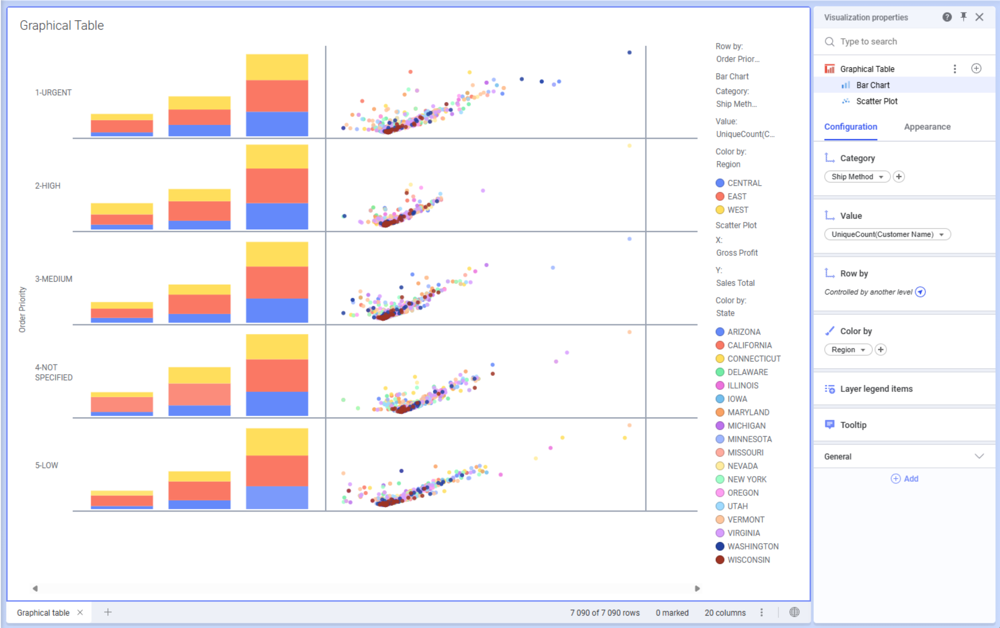

# ts-dev-graphical-table

This example project is meant to show how you can use the layers feature of visualization mods.
This feature allows a visualization to define a layer type which there can then be an arbitrary number of instances of.
In this visualization we render a graphical table where each layer instance results in a column in the table.

The layer types defined are a simple stacking bar chart and a scatter plot.
The main data view defines a splitting "Row by" axis which is ten inherited into every layer.
Since the axis is inherited we can obtain the relevant hierarchy leaf by finding the same leaf index in the layer's data view.

Each layer instance defines its own width via a mod property such that column widths can vary across the table.
The row height of the table is controlled as a top-level mod property.
